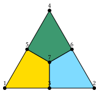
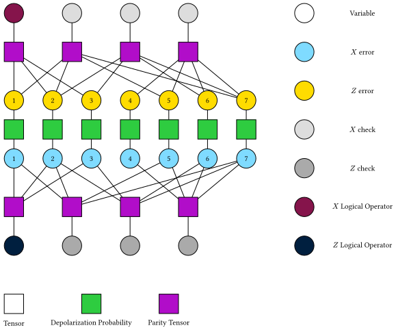
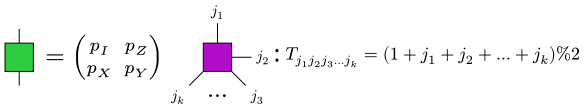

# Tensor Network Decoder

In this section, we introduce the tensor network decoder.

## Marginal Maximum A Posteriori (MMAP) Decoder

[`TNMMAP`](@ref) is a tensor network based marginal maximum a posteriori (MMAP) decoder, which finds the most probable logical sector after marginalizing out the error pattern on qubits. We can generate a `TNMMAP` decoder by `TNMMAP()`.
```@example tndecoder
using TensorQEC, TensorQEC.OMEinsum
decoder = TNMMAP(TreeSA(), true)
```
Here `TreeSA()` is the default optimizer for optimizing the tensor network contraction order.

Now we use the Steane code as an example.


```@example tndecoder
steane = SteaneCode()
tanner = CSSTannerGraph(steane)
st = stabilizers(steane)
```
Given a depolarizing error model, we can randomly generate an error pattern

```@example tndecoder
error_model = iid_error(0.05,0.05,0.05, 7)
using Random
Random.seed!(1)
error_pattern = random_error_qubits(error_model)
```

Now we can measure the syndrome:
```@example tndecoder
syndrome = syndrome_extraction(error_pattern, tanner)
```

To use the decoder, we need to compile it first.

```@example tndecoder
compiled_decoder = compile(decoder, tanner, error_model);
```
At this time we generate the tensor network[^Piveteau] for the code and the error model, as shown in the following figure.


The squares represent tensors, and the circles represent the indices of the tensors. All indices are of dimension 2. We use 7 indices to represent $X$ errors on qubits, and 7 indices to represent $Z$ errors on qubits. On each qubit, the distribution of this two types of errors is correlated. The green squares represent this correlation.
All purple squares represent the parity tensor, which elements are 1 if the input parity is even, and 0 otherwise.


The gray circles represent the syndrome and the brown circles represent the logical operators. The marginal maximum a posteriori (MMAP) decoding problem is to find the most probable logical sector, given the syndrome and marginalize out the error pattern on qubits.

The contraction order of the tensor network is optimized by the optimizer `decoder.optimizer` and the optimal contraction order is stored in `compiled_decoder.code`.

```@example tndecoder
contraction_complexity(compiled_decoder.code,uniformsize(compiled_decoder.code, 2))
```

Now we can decode the syndrome. The decoding process is to update the syndrome into the tensor network, and then contract the tensor network to get the marginal probability. According to the maximum marginal probability, we can get the most probable logical sector.

```@example tndecoder
result = decode(compiled_decoder, syndrome)
```

Also, we can use the `decode` function to decode the syndrome directly.

```@example tndecoder
result = decode(compiled_decoder, syndrome)
```
To check the decoding result, we can first check whether we get a same syndrome as the input syndrome.
```@example tndecoder
syndrome == syndrome_extraction(result.error_qubits, tanner)
```

Then we can check whether there is a logical error. First we need to get the logical operators.
```@example tndecoder
lx, lz = logical_operator(tanner)
check_logical_error(result.error_qubits, error_pattern, lx, lz)
```

Here `false` means no logical error, and `true` means there is a logical error.


## Maximum A Posteriori (MAP) Decoder

[`TNMAP`](@ref) is a tensor network based maximum a posteriori (MAP) decoder, which finds the most probable configuration of the error pattern. The decoding process is similar to the MMAP decoder.

```@example tndecoder
compiled_decoder = compile(TNMAP(), tanner, error_model);
decode(compiled_decoder, syndrome)
```


[^Piveteau]: Piveteau, C.; Chubb, C. T.; Renes, J. M. Tensor Network Decoding Beyond 2D. PRX Quantum 2024, 5 (4), 040303. https://doi.org/10.1103/PRXQuantum.5.040303.
